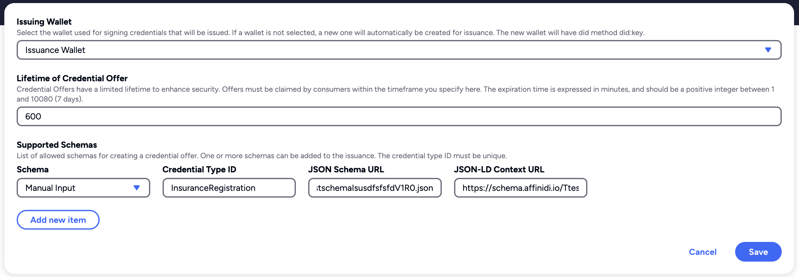

# Introduction

This is a reference app generated by Affinidi CLI tool with Java and Springboot framework


## Prerequisite 

1. Make sure you have [JAVA 21](https://jdk.java.net/21/) installed on your machine. Run the following command in a terminal session to check the java version

```sh 
   java --version 
```
You should get an output as below. If not, please reinstall java21 using the link above
```sh
openjdk 21.0.2 2024-01-16
```
2. Ensure that your JAVA_HOME environment variable is set to the installation directory
```sh
export JAVA_HOME="/usr/local/opt/openjdk"
```
3. Optionally you can add this entry to your respective profile (~/.bashrc or ~/.zshrc)


## Getting Started

Setting up the reference app is easy, just follow these steps:

1. Install the dependencies
```sh
sh mvnw clean
sh mvnw install
```

2. Update application environment variables 

Create a .env file for your application to hold environment variables

```sh
cp .env.example .env
```

3. Click here to [Set up your environment variables for Affinidi Login configuration](#set-up-your-affinidi-login-configuration)

4. Click here to [Set up your Personnel Access Token to interact with Affinidi services](#setup-personal-access-token)

5. Click here to [Set up your Credential Issuance Configuration](#setup-credential-issuance-configuration)


## Build and run the project:

```sh
sh mvnw spring-boot:run
```
Then visit: http://localhost:8080/ to browse the reference app


## Set up your Affinidi Login configuration

1. Follow [this guide](./docs/setup-login-config.md) to set up your login configuration with callback URL as `http://localhost:8080/login/oauth2/code/javademo`

2. Copy your **Client ID**, **Client Secret** and **Issuer** from your login configuration and paste them into your `.env` file:

```ini
PROVIDER_CLIENT_ID="<CLIENT_ID>"
PROVIDER_CLIENT_SECRET="<CLIENT_SECRET>"
PROVIDER_ISSUER="<ISSUER>"
```

## Setup Personal Access Token

Follow [this guide](./docs/create-pat.md) to set up your Personnel Access Token


# Setup Credential Issuance Configuration

To issue a Verifiable Credential, it is required to setup the **Issuance Configuration** on your project, where you select the **issuing wallet** and **supported schemas** to create a credential offer that the application issue

You can easily do this using the [Affinidi Portal](https://portal.affinidi.com)

1. Go to [Affinidi Portal](https://portal.affinidi.com).

2. Open `Wallets` menu under the `Tools` section and click on `Create Wallet` with any name (e.g. `MyWallet`) and DID method as `did:key`.
    

For more information, refer to the [Wallets documentation](https://docs.affinidi.com/dev-tools/wallets)

3. Go to `Credential Issuance Service` under `Services` section.

4. Click on `Create Configuration` and set the following fields:

    `Issuing Wallet`: Select Wallet Created previous step
    `Lifetime of Credential Offer` as `600`
    
5. Add schemas by clicking on "Add new item" under `Supported Schemas`

Schema 1 : 
- *Schema* as `Manual Input`, 
- *Credential Type ID* as `InsuranceRegistration`
- *JSON Schema URL* as `https://schema.affinidi.io/TtestschemaIsusdfsfsfdV1R0.json`
- *JSDON-LD Context URL* = `https://schema.affinidi.io/TtestschemaIsusdfsfsfdV1R0.jsonld`

Sample Configuration
